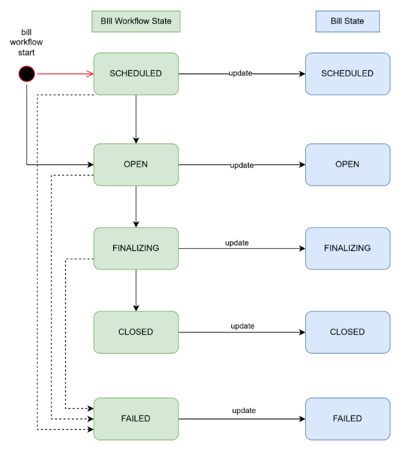
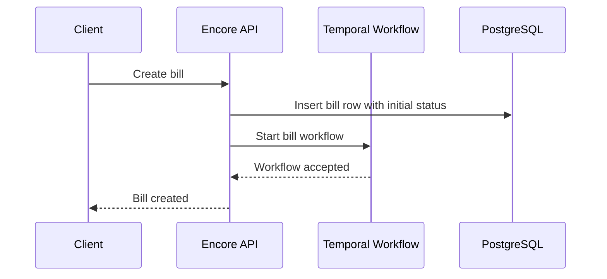
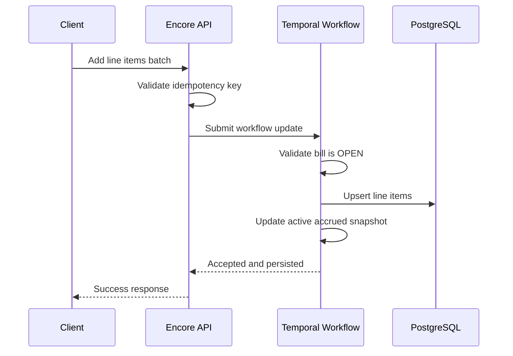
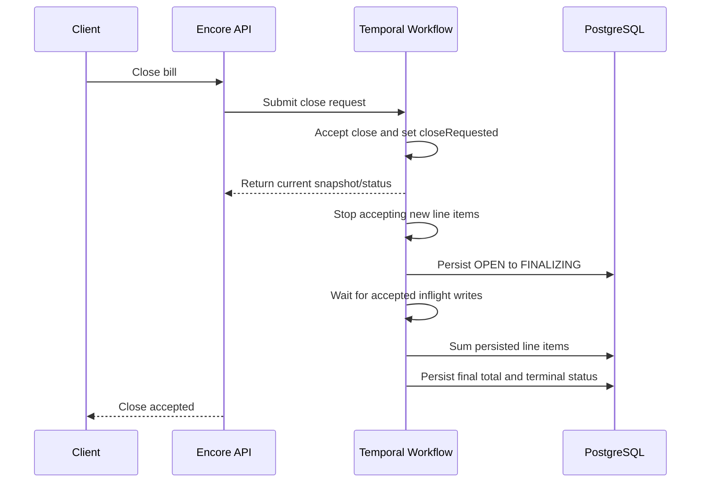
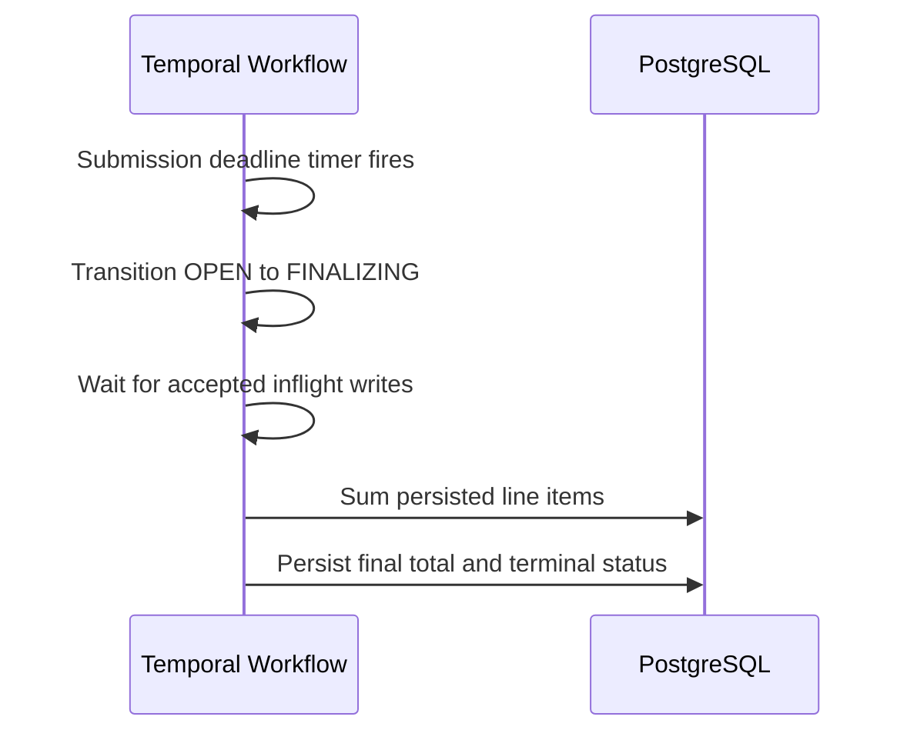

# Fees API - PaveBank Engineering Spec

# Table of Contents

- [1. Overview](#1-overview)
- [2. Objective](#2-objective)
- [3. Assumptions](#3-assumptions)
- [4. Design Goals](#4-design-goals)
- [5. Non-Goals](#5-non-goals)
- [6. Architecture](#6-architecture)
  - [6.1 Architectural TradeOff Considered](#61-architectural-tradeoff-considered)
    - [Option A — Temporal as Orchestrator Only](#option-a--temporal-as-orchestrator-only)
    - [Option B — Temporal-Serialized Mutations (Chosen for This Coding Challenge)](#option-b--temporal-serialized-mutations-chosen-for-this-coding-challenge)
  - [6.2 Bill Lifecycle and State Model](#62-bill-lifecycle-and-state-model)
    - [Workflow State Diagram](#workflow-state-diagram)
    - [Workflow States](#workflow-states)
    - [Transition Rules](#transition-rules)
  - [6.3 Business Flows](#63-business-flows)
    - [Create Bill](#create-bill)
    - [Add Line Items](#add-line-items)
    - [Manual Close Bill](#manual-close-bill)
    - [Automatic Close Bill](#automatic-close-bill)
    - [Get Bill](#get-bill)
  - [6.4 System Guarantees & Design Considerations](#64-system-guarantees--design-considerations)
    - [6.4.1 Write Correctness & Consistency](#641-write-correctness--consistency)
      - [Concurrency and Ordering](#concurrency-and-ordering)
      - [Idempotency](#idempotency)
        - [API Idempotency](#api-idempotency)
        - [API-Layer Idempotency](#api-layer-idempotency)
        - [Temporal Workflow Update Idempotency](#temporal-workflow-update-idempotency)
        - [Temporal Workflow Activity Idempotency](#temporal-workflow-activity-idempotency)
    - [6.4.2 Temporal Semantics & Lifecycle Boundaries](#642-temporal-semantics--lifecycle-boundaries)
      - [Late Arrivals and Submission Deadline](#late-arrivals-and-submission-deadline)
    - [6.4.3 Financial Correctness](#643-financial-correctness)
      - [Money and Currency](#money-and-currency)
    - [6.4.4 Failure Handling & Reliability](#644-failure-handling--reliability)
      - [Retry Policy](#retry-policy)
      - [Operational Handling for Failed Finalization](#operational-handling-for-failed-finalization)
    - [6.4.5 Validation & API Constraints](#645-validation--api-constraints)
      - [Validation and Request Limits](#validation-and-request-limits)
    - [6.4.6 Scalability & Data Management](#646-scalability--data-management)
      - [Event History Size](#event-history-size)
      - [Pagination](#pagination)
    - [6.4.7 Observability & Operations](#647-observability--operations)
      - [Observability for the Coding Challenge](#observability-for-the-coding-challenge)
- [7. API Contracts](#7-api-contracts)
  - [Error Contract](#error-contract)
  - [POST /v1/bills](#post-v1bills)
  - [POST /v1/bills/{bill_id}/line-items](#post-v1billsbill_idline-items)
  - [POST /v1/bills/{bill_id}/close](#post-v1billsbill_idclose)
  - [GET /v1/bills/{bill_id}](#get-v1billsbill_id)
  - [GET /v1/bills/{bill_id}/line-items](#get-v1billsbill_idline-items)
- [8. Data Model (PostgreSQL)](#8-data-model-postgresql)
  - [Bills](#bills)
    - [Columns](#columns)
    - [Constraints](#constraints)
    - [Indexes](#indexes)
  - [LineItems](#lineitems)
    - [Columns](#columns-1)
    - [Constraints](#constraints-1)
    - [Indexes](#indexes-1)
  - [IdempotencyRecords](#idempotencyrecords)
    - [Columns](#columns-2)
    - [Constraints](#constraints-2)
    - [Indexes](#indexes-2)

## 1. Overview

This spec proposes a Fees API implementation for PaveBank. The system manages bill creation, line-item ingestion, bill snapshots during the active period, and final bill closure.

Core user flows:

- Create a new bill for a billing period.
- Add line items to an active bill, including batch submission.
- Query a bill before closure to view current items and an accrued total snapshot.
- Close the bill at the end of the billing period and compute the final charged amount.
- Query a closed bill to view the final total and all related line items.

## 2. Objective

Build a bill workflow using Temporal Workflow and expose the required APIs using Encore. The implementation language is Go.

## 3. Assumptions

- Expected scale is relatively small: hundreds to thousands of line items per bill.
- Correctness and operational simplicity are more important than high-throughput optimization.
- It is valid to have multiple active bill lifecycles within the same billing period when they serve different business purposes.

## 4. Design Goals

- Support bill creation, line-item addition, and bill closure end to end.
- Prioritize correctness and deterministic ordering, especially around concurrent add-line-item and close-bill requests.
- Ensure financial data integrity.
- Make APIs idempotent because duplicate billing is unacceptable.
- Support multi-currency billing at the system level while keeping each individual bill single-currency.
- Keep the design easy to reason about under low-to-moderate load.

## 5. Non-Goals

- Updating a bill after creation.
- Deleting a bill.
- Updating a line item after creation.
- Deleting a line item.
- Frontend implementation.
- Authentication and authorization design.

## 6. Architecture

The system uses:

- `Encore` for synchronous API exposure.
- `Temporal` for serialized bill lifecycle orchestration after a bill has been created.
- `PostgreSQL` for durable bill and line-item persistence.

## 6.1 Architectural TradeOff Considered
### Option A — Temporal as Orchestrator Only
In this model, Temporal is used primarily for workflow orchestration and bill lifecycle coordination, while line-item persistence happens outside the workflow through direct database writes.

High-level behavior:

- APIs validate requests and persist line items directly into PostgreSQL.
- Temporal coordinates lifecycle state transitions such as:
  - `SCHEDULED -> OPEN`
  - `OPEN -> FINALIZING`
  - `FINALIZING -> CLOSED`
- After successful line-item persistence, the API or persistence layer emits a Temporal Signal or Update so the workflow can:
  - update the in-memory accrued snapshot
  - track bill progress
  - coordinate closure timing

Benefits of this approach:

- Higher throughput because line-item persistence is not serialized through a single workflow execution loop.
- Better horizontal scalability for heavy write workloads.
- Reduced workflow event-history growth because the workflow does not directly execute every persistence operation.
- Lower workflow pressure for bills with very large numbers of line items.

However, this approach introduces significantly more consistency complexity.

The main challenge is correctness around concurrent line-item ingestion and bill closure.

Example race condition:

1. A line item is successfully persisted directly into PostgreSQL.
2. Before the workflow processes the corresponding snapshot-update signal, a close request transitions the bill into `FINALIZING`.
3. The final summation runs before the workflow becomes aware of the newly persisted line item.
4. The bill could incorrectly close with an incomplete total.

To make this architecture correct, additional coordination mechanisms are required.

Possible approaches include:

- Persisting a monotonic sequencing marker or ingestion offset for every accepted line-item write.
- Having the workflow track the highest acknowledged persisted sequence before allowing finalization.
- Introducing a write barrier during close so new persistence operations cannot commit once finalization begins.
- Using database transactions together with bill-version checks or optimistic concurrency control.
- Recomputing the final total from persisted data only after all admitted persistence operations are durably acknowledged by the workflow.
- Using an outbox or event-driven mechanism so persistence and workflow notification become atomically observable.

This architecture can achieve substantially higher throughput, but correctness becomes more subtle because persistence ordering and workflow ordering are no longer inherently coupled.

### Option B — Temporal-Serialized Mutations (Chosen for This Coding Challenge)

The chosen implementation routes bill mutations through the Temporal workflow itself.

In this design:

- Add-line-items requests are admitted and serialized by the workflow.
- Persistence activities execute under workflow coordination.
- The workflow directly controls:
  - lifecycle transitions
  - line-item admission
  - mutation ordering
  - accrued snapshot updates
  - finalization timing

Benefits of this approach:

- Simpler reasoning about correctness and lifecycle ordering.
- Strong deterministic sequencing for concurrent add-line-item and close-bill requests.
- Easier handling of cutoff semantics and finalization drain behavior.
- Lower risk of subtle race conditions between persistence and closure.

Tradeoffs:

- Lower maximum throughput because bill mutations are effectively serialized per workflow.
- Larger workflow histories for long-running or high-volume bills.
- Greater dependence on Continue-As-New for long-lived workflows.

For this coding challenge, correctness, determinism, and operational simplicity are prioritized over maximum write scalability, so this architecture was selected.

Note:

- The original Google Doc appears to contain architecture diagrams, but they were not included in the pasted content. This Markdown version converts those missing diagrams into textual flow definitions.

## 6.2 Bill Lifecycle and State Model

The system maintains two related state models:

- Workflow state in Temporal for serialized lifecycle control.
- Persisted bill state in PostgreSQL for query APIs and durable business records.

`FINALIZING` is persisted in the bill row so downstream readers and polling clients can observe that the bill is no longer accepting new submissions and is in the process of closing. The workflow remains authoritative for transition ordering and finalization logic.

As a result:

- Readers will observe `FINALIZING` in PostgreSQL while accepted line-item work is draining and final summation is still in progress.
- Readers will observe `CLOSED` only after finalization completes successfully.
- Readers will observe `FAILED` if finalization reaches a terminal failure or another unhandled workflow error is persisted and needs investigation.
- Before terminal completion, the current accrued snapshot lives in workflow memory and may continue changing until the bill reaches `CLOSED` or `FAILED`.
- The manual close API returns as soon as the workflow accepts the close request, which means the accepted response may still show the pre-transition snapshot and `OPEN` status even though no further line items will be admitted.

### Workflow State Diagram



### Workflow States

| Workflow State | Description | Allowed Next State | Persisted DB State |
| --- | --- | --- | --- |
| `SCHEDULED` | Bill workflow exists but billing period has not started. No line items are accepted. | `OPEN` | Bill row exists with status `SCHEDULED`. |
| `OPEN` | Billing period is active. New line items are accepted and serialized through the workflow. A line item is bill-eligible when its `occurred_at` timestamp falls within the configured billing period and the request is accepted strictly before `line_items_submission_deadline`. | `FINALIZING` | Bill row status is `OPEN`. Persisted line items are written to PostgreSQL, while the current accrued snapshot is tracked in workflow memory until finalization. |
| `FINALIZING` | Workflow state entered when `line_items_submission_deadline` is reached or a manual close is accepted. No new line items are accepted. The workflow waits for already accepted line-item work to complete, then computes the authoritative final total from persisted data and persists the terminal bill snapshot. | `CLOSED`, `FAILED` | Bill row status is `FINALIZING` until the final close activity commits `CLOSED` or `FAILED`. |
| `CLOSED` | Terminal state. Final total is computed and persisted. No new line items are accepted. | None | Bill row status is `CLOSED` with final total and closure timestamp. |
| `FAILED` | Terminal failure state. In the current implementation, this state is used for any unhandled workflow error that reaches the top-level workflow error handler, including but not limited to finalization failures. The bill requires investigation or manual remediation. | None | Bill row status is `FAILED` with failure timestamp and failure summary. |

### Transition Rules

| Transition | Trigger | Notes |
| --- | --- | --- |
| `SCHEDULED -> OPEN` | Billing start time is reached | Driven by a Temporal timer. Persisted bill status changes to `OPEN` only after the corresponding activity succeeds. |
| `OPEN -> FINALIZING` | `line_items_submission_deadline` is reached, or a manual close request is accepted | Manual close overrides the remaining submission window. Once the close request is accepted, the workflow stops admitting new line items immediately and then asynchronously persists the `FINALIZING` transition. Requests accepted strictly before the cutoff are allowed to finish processing. Requests admitted at or after the cutoff are rejected. |
| `FINALIZING -> CLOSED` | All accepted in-flight additions are complete and final summation succeeds | The workflow recomputes the final total from persisted line items and persists the terminal bill snapshot. |
| `FINALIZING -> FAILED` | Final summation or final persistence reaches a terminal failure | The workflow persists `FAILED`, records failure details, and stops accepting any further mutations for that bill. Per-item line-item failures inside completed add-line-items requests do not trigger this transition. |
| `SCHEDULED`, `OPEN`, or `FINALIZING` -> `FAILED` | Any other unhandled workflow error reaches the top-level workflow error handler | This includes setup failures and activity failures that are not recovered within the workflow. The current implementation does not reserve `FAILED` exclusively for finalization-time errors. |

## 6.3 Business Flows

### Create Bill

1. API receives a create-bill request.
2. A bill row is persisted in PostgreSQL with status `SCHEDULED` or `OPEN`, depending on whether the billing period has already started.
3. The system creates or starts the corresponding Temporal workflow.
4. The workflow waits for the billing start time if the bill begins in the future.

Current implementation note:

- Bill persistence happens before workflow start, and those two actions are not wrapped in a single atomic unit.
- If the bill row is committed successfully but workflow start fails, the API currently returns `500 Internal Server Error` even though the bill already exists in PostgreSQL.
- A client retry with the same idempotency key can still replay the original create-bill outcome through the idempotency layer, but a retry with a different idempotency key may encounter a business conflict because the bill row already exists.

Workflow identity:

- Each bill lifecycle uses the deterministic Temporal Workflow ID `bill-workflow-id-{bill_id}`.
- The create-bill path should use this workflow ID to avoid duplicate workflow instances for the same bill.



### Add Line Items

1. API receives a batch add-line-items request for a bill.
2. API enforces idempotency at the request boundary.
3. The request is forwarded to the Temporal workflow.
4. The workflow accepts the mutation only when the bill is in `OPEN`.
5. Persistence activities write the submitted line items to PostgreSQL idempotently.
6. The workflow keeps an in-memory accrued snapshot during the active bill lifecycle and persists the authoritative total only during finalization.



### Manual Close Bill

1. API submits a close request to the workflow.
2. The workflow validates that the bill is still `OPEN`, records `closeRequested = true`, and immediately returns an accepted response with the current snapshot.
3. From that acceptance point onward, no new line items are admitted, even though the persisted bill row may still briefly read `OPEN`.
4. The workflow exits its open-state loop, persists the transition from `OPEN` to `FINALIZING`, and then waits for all already accepted in-flight line-item writes to finish.
5. The workflow performs authoritative summation from persisted line items.
6. If final summation or final persistence reaches a terminal failure, the bill transitions to `FAILED` and requires investigation or manual remediation.
7. Otherwise, the final bill snapshot is persisted and the bill transitions to `CLOSED`.
8. The close API returns after the close request is accepted; it is an asynchronous acknowledgement, not proof that finalization has started or finished.
9. Clients should poll `GET /v1/bills/{bill_id}` until `bill_status = CLOSED` or `bill_status = FAILED` to observe terminal completion in this coding challenge.
10. Polling is the chosen mechanism here because it keeps the challenge implementation simple and honest about asynchronous completion without introducing an outbound delivery subsystem.
11. Webhook or notification-based completion signaling becomes the better fit when close latency is longer, client count is larger, or downstream systems need push delivery instead of repeated reads.



### Automatic Close Bill

1. A Temporal timer fires when the `line_items_submission_deadline` is reached.
2. The workflow transitions from `OPEN` to `FINALIZING`.
3. The same finalization sequence as manual close is executed.



### Get Bill

1. API handles `GET /v1/bills/{bill_id}` by reading persisted bill metadata from PostgreSQL.
2. Bill progress, including `FINALIZING`, is observed from persisted bill state.
3. Before the bill reaches `CLOSED`, the endpoint returns the current accrued total snapshot through `snapshot_total_amount_minor`, sourced from workflow state for active bills.
4. Once the bill is `CLOSED`, the endpoint returns the final authoritative amount through `final_total_amount_minor`.
5. If the bill is `FAILED`, the endpoint returns the last workflow-derived `snapshot_total_amount_minor` together with failure details for investigation.

# 6.4 System Guarantees & Design Considerations
This section outlines the core system guarantees and the design considerations that ensure correctness, reliability, and operational simplicity for the billing workflow.

## 6.4.1 Write Correctness & Consistency

### Concurrency and Ordering

Race conditions are a major concern when add-line-item and close-bill requests happen concurrently.

This design uses Temporal to serialize state transitions:

- External interactions are recorded in Temporal event history.
- The workflow processes events deterministically and one at a time.
- Concurrent requests are reduced to an ordered sequence at the workflow layer.

This approach is sound for coordinating:

- Whether a line item was accepted before or after the close cutoff.
- When finalization may start.
- When the final total may be computed.
- In this design, a line item accepted before the cutoff may still be completing persistence work while the workflow is already in `FINALIZING`.

Drain tracking mechanism:

- The workflow tracks in-flight mutation work with two pieces of workflow state: an `activeUpdateCounts` counter and a `lineItemsPersisted` channel used to signal that an admitted add-line-items update has durably finished its persistence step.
- When an add-line-items request is admitted while the bill is `OPEN` and before the cutoff, the workflow increments `activeUpdateCounts`, executes the persistence activity, updates the in-memory snapshot on success, and emits a `lineItemsPersisted` notification.
- When the update handler returns, `activeUpdateCounts` is decremented.
- During `FINALIZING`, the workflow waits until `activeUpdateCounts == 0` and the `lineItemsPersisted` channel has been drained before recomputing the final total.
- Retryable activity failures keep the update in flight because the handler does not complete until the activity chain reaches a durable outcome.
- Per-item business failures inside a completed batch do not advance the accrued snapshot and do not block bill-level closure once the update itself has reached its durable result.
- `Continue-As-New` should not be triggered while admitted work is still draining. If `Continue-As-New` is used, the carried workflow state should include the current accrued snapshot and close-request flag.

Why explicit drain tracking is needed:

- Temporal guarantees deterministic workflow execution, but it does not automatically know which work items count as bill-critical pre-cutoff additions for this domain rule.
- The close operation must wait only for add-line-items requests that were already admitted before the cutoff, not for every activity that might exist in the workflow runtime.
- Retryable activity failures must continue to block close, while completed requests must stop blocking close. Explicit workflow state makes that rule deterministic and replay-safe.
- The workflow also needs a business-level definition of "done" that survives worker restarts and workflow replay. The in-flight update counter plus persisted-notification drain state provide that definition directly in workflow state.
- In this design, per-item failures inside a completed add-line-items batch are normal business outcomes and do not prevent bill closure.

Acceptance semantics at the cutoff:

- Deadline eligibility is determined by workflow admission time, not by raw HTTP receipt time.
- A request received by the API before `line_items_submission_deadline` may still be rejected if the workflow does not admit it until after the cutoff.
- A request admitted by the workflow before the cutoff is allowed to finish even if persistence completes after the cutoff and the bill is already in `FINALIZING`.
- A request admitted exactly at `line_items_submission_deadline` is treated as late and rejected. The accepted window is therefore `[billing_period_start_at, line_items_submission_deadline)`, while bill event-time inclusion remains `[billing_period_start_at, billing_period_end_at]`.

### Idempotency

#### API Idempotency

Idempotency is required because duplicate billing is unacceptable.

Preferred approach:

- Client supplies an idempotency key.
- Server validates and stores the key within the relevant operation scope.
- Repeated requests with the same key return the original outcome instead of creating duplicate effects.
- For batch line-item submission, the original outcome includes the same response body that was returned for the first successful processing of that idempotency key.

Why this is preferred for the current scope:

- Simpler than combining an idempotency key with a hashed request body.
- Avoids complexity around JSON canonicalization, key sorting, and hashing rules.
- Good enough for a low-scale internal or controlled-client use case.
- In this simplified design, idempotency lookup is based on `(idempotency_key, operation_type)`, and the implementation should also persist a lightweight request fingerprint so the server can detect accidental reuse of the same key+operation with a different request body.

Interruption and retry handling:

- When a request first reserves an idempotency key, the server persists an idempotency record as `IN_PROGRESS`.
- If the request completes successfully, the record is updated to `COMPLETED` together with the original HTTP status and response body for exact replay.
- If a retry arrives while the record is still `IN_PROGRESS` and the in-progress lease has not expired, the server should return a retryable conflict or in-progress error rather than start a second execution.
- If the retry arrives after the in-progress lease has expired, the server may treat the previous attempt as abandoned and allow a fresh execution to claim a new in-progress lease for the same key and operation.
- This keeps the design safe under worker crashes or server interruption while preserving exact replay once a response has been durably recorded.

#### API-Layer Idempotency

- For batch line-item submission, a repeated request with the same idempotency key should replay the exact original response rather than selectively reprocess only previously failed items. If the client wants to retry only failed line items, it should send a new request with a new idempotency key containing only those items.
- If the same business reference is submitted again with a different idempotency key after the original request has already succeeded, the API should return a conflict error rather than treating it as a replay.
- If the same idempotency key and operation is retried with a different request payload, the API should return a conflict error rather than replaying or re-executing the request.

#### Temporal Workflow Update Idempotency

- The current implementation does not provide an explicit Temporal `UpdateID` when issuing workflow updates.
- In practice, retry replay and duplicate-request protection are enforced at the HTTP boundary by the idempotency middleware before the request reaches the workflow client.
- Temporal still provides ordering and single-workflow coordination for accepted updates, but this implementation should not be described as relying on Temporal update deduplication for public API retries.
- If the workflow evolves to rely on Temporal-side update deduplication in the future, it should pass explicit update identifiers and define how deduplication behaves across `Continue-As-New`.

#### Temporal Workflow Activity Idempotency

- Bill identity is unique by `(account_id, external_reference_id)`.
- Line-item identity is unique by `(bill_id, external_reference_id)`.
- Line-item and bill persistence activities should rely on unique constraints and explicit PostgreSQL upsert semantics. Use `INSERT ... ON CONFLICT DO UPDATE` when the desired behavior is to converge to a known persisted state, and `INSERT ... ON CONFLICT DO NOTHING` only when duplicate replays should be ignored without changing stored values.
- Update activities should write known values rather than perform non-idempotent arithmetic like `increment by X`.

## 6.4.2 Temporal Semantics & Lifecycle Boundaries

### Late Arrivals and Submission Deadline

The design allows for valid line items that were transacted shortly before billing period end but arrive for processing slightly later.

Proposed behavior:

- A bill should expose a semantic `line_items_submission_deadline` timestamp rather than a raw grace period in minutes.
- Billing period inclusion is determined by `occurred_at`, which must fall within the inclusive billing period interval `[start, end]`.
- `line_items_submission_deadline` may be later than the billing period end to allow clients to submit valid late-arriving items that occurred before the period ended.
- Manual close overrides the remaining submission window immediately; the workflow acknowledges the close first and then asynchronously persists `FINALIZING` and finalization progress.
- Once closure completes, any later valid charges must roll into the next billing period.

## 6.4.3 Financial Correctness

### Money and Currency

- All monetary amounts are stored in minor units using `int64`.
- Currency metadata is provided by an internal currency package for this coding challenge rather than an external service.
- The system supports multiple currencies overall, specifically `GEL` and `USD` for this coding challenge.
- Each individual bill is single-currency. All line items attached to a bill must use the same currency as the bill, and charges in different currencies must be represented as separate bills.
- The currency package should expose at least:
  - currency code, such as `GEL` or `USD`
  - currency exponent, which is required when converting from minor units to major units for display or integration boundaries
- Calculations within the billing domain should use minor units only. Conversion to major units should happen only at presentation or integration boundaries.
- For this coding challenge, `amount_minor` must be strictly greater than `0`. Negative adjustments, credits, and reversals are intentionally out of scope.

## 6.4.4 Failure Handling & Reliability

### Retry Policy

Activities should distinguish retryable from non-retryable failures.

Retryable examples:

- Transient network issues.
- Temporary database connectivity failures.
- Temporary overload conditions.

Non-retryable examples:

- Resource not found.
- Constraint violations.
- Data validation failures.
- Other business-rule validation failures.

Recommended retry behavior:

- Exponential backoff.
- Maximum of `3` attempts total, including the first attempt.

### Operational Handling for Failed Finalization

- Retryable failures during finalization should be handled by the workflow retry policy first.
- If finalization still reaches a terminal failure, the bill transitions to `FAILED`, persists `failed_at` and `failure_reason`, and rejects any further public mutations.
- `GET /v1/bills/{bill_id}` should expose the failure details needed for investigation.
- For this coding challenge, remediation is manual investigation using persisted bill data, workflow history, and application logs rather than a public retry API.
- A future production-grade evolution may add an internal-only operator action to retry or resume failed finalization after the underlying issue is fixed.
- This section refers to finalization-specific handling guidance. The current implementation may also mark a bill as `FAILED` for other unhandled workflow errors. It does not include normal per-item failures returned from `POST /v1/bills/{bill_id}/line-items`.

## 6.4.5 Validation & API Constraints

### Validation and Request Limits

- The current handlers require `external_reference_id` to be present, but they do not yet enforce a regex or maximum length.
- Restricting `external_reference_id` to `1` to `128` characters and limiting characters to ASCII alphanumeric plus `.` `_` `:` and `-` remains a recommended hardening step rather than a current guarantee.
- Recommended pattern for a future stricter implementation: `^[A-Za-z0-9][A-Za-z0-9._:-]{0,127}$`.
- The current handlers do not yet enforce a maximum length for `line_items[].description`.
- Limiting `line_items[].description` to at most `512` characters remains a recommended hardening step for request-size control and more predictable event-history growth.
- `POST /v1/bills/{bill_id}/line-items` should allow at most `100` line items per request.
- This bound keeps a single workflow Update reasonably small, reduces risk of oversized event-history entries, limits long-running admitted requests that would block finalization, and keeps request/response payloads manageable for the coding challenge.
- `Continue-As-New` mitigates long-term workflow history growth, but it does not reduce the size of an individual add-line-items request. A per-request batch limit is still required.
- The current implementation rejects `page_size > 100` with a validation error instead of silently capping it.

## 6.4.6 Scalability & Data Management

### Event History Size

This workflow may be long running, potentially for a month or longer, so event history growth must be considered.

Known contributors to history bloat:

- High frequency of batch line-item additions.
- Repeated use of workflow side effects for generated identifiers.

Suggested mitigations:

- Support batch line-item ingestion.
- Avoid unnecessary workflow side effects.
- Pass generated identifiers as inputs where possible instead of generating them inside workflow side effects.
- Use `Continue-As-New` for long-running bill workflows when event history grows large.
- Follow Temporal's suggested threshold by checking `workflow.GetInfo(ctx).GetContinueAsNewSuggested()`.
- Trigger `Continue-As-New` only from the main workflow function after all Signal and Update handlers have completed, and carry forward the minimum workflow state required for the next run.

### Pagination

Pagination is required for:

- Listing many line items for one bill.

Reasons:

- Avoid oversized payloads.
- Reduce latency and timeout risk.
- Avoid unbounded reads.
- Limit memory usage for API consumers.

## 6.4.7 Observability & Operations

### Observability for the Coding Challenge

- The implementation should emit structured logs for bill state transitions, close initiation, finalization retries, finalization failure, and successful closure.
- Logging is sufficient for this coding challenge.
- Metrics, dashboards, and alerting for stuck `FINALIZING` or `FAILED` bills are valuable future improvements but are not required in the current scope.

## 7. API Contracts

Contract-wide conventions:

- All request and response bodies use JSON.
- All timestamps use RFC 3339 format in UTC.
- All monetary amounts use minor units in `int64`.
- Supported currencies for this challenge are `GEL` and `USD` only.
- `Idempotency-Key` is required for `POST` endpoints that create or mutate bill state.
- Pagination uses `page_size` and opaque `page_token`.
- In this coding challenge, clients should use polling via `GET /v1/bills/{bill_id}` to observe asynchronous bill closure after `POST /v1/bills/{bill_id}/close`.
- Polling is deliberately chosen here to keep the challenge implementation simple: the server only needs to accept the close request and expose bill status consistently through `GET /v1/bills/{bill_id}`.
- For a production-grade system, webhook or notification-based completion signaling is strongly preferred once polling fan-out, close latency, or downstream integration needs make repeated client reads inefficient or operationally noisy.
- PostgreSQL is the persisted source of truth for durable bill and line-item records. During active bill processing, workflow memory is authoritative for the accrued snapshot exposed by read APIs until finalization persists the terminal total.
- `external_reference_id` values must match `^[A-Za-z0-9][A-Za-z0-9._:-]{0,127}$`.
- The system supports multiple currencies overall, but each bill is single-currency and every submitted line item must match the owning bill currency.

### Error Contract

All API errors should use a consistent JSON shape:

```json
{
  "code": "conflict",
  "message": "bill is already closed"
}
```

Recommended status semantics for this coding challenge:

- `400 Bad Request` for malformed JSON, invalid field formats, duplicate `external_reference_id` values within the same batch, unsupported currency codes, non-positive `amount_minor`, and other request validation failures.
- `404 Not Found` when the referenced bill does not exist.
- `409 Conflict` for bill state conflicts, duplicate business references under a different idempotency key, idempotency-key reuse with a different request payload, and retries against an unexpired `IN_PROGRESS` idempotency record.
- `500 Internal Server Error` for unexpected server-side failures that are not expressed through the public bill state model.

### POST /v1/bills

Success status: `201 Created`

#### Headers

| Field Name | Data Type | Description | Optional | Default |
| --- | --- | --- | --- | --- |
| `Content-Type` | string | Must be `application/json`. | No | - |
| `Idempotency-Key` | string | Client-supplied idempotency key for safe retries. | No | - |

#### Request Body

| Field Name | Data Type | Description | Optional | Default |
| --- | --- | --- | --- | --- |
| `account_id` | string | Account identifier that owns the bill. | No | - |
| `external_reference_id` | string | Client-defined idempotent business reference for the bill. Must be unique within the same `account_id`. | No | - |
| `currency_code` | string | Bill currency code. Allowed values are `GEL` and `USD` only. | No | - |
| `billing_period_start_at` | string (RFC 3339 timestamp) | Inclusive billing period start timestamp. | No | - |
| `billing_period_end_at` | string (RFC 3339 timestamp) | Inclusive billing period end timestamp. | No | - |
| `line_items_submission_deadline` | string (RFC 3339 timestamp) | Last timestamp at which line items for this bill may be submitted. Must be greater than or equal to `billing_period_end_at`. This allows client-defined buffer time after period end (for example, to handle late-arriving submissions). Requests admitted at or after `line_items_submission_deadline` are rejected. | No | - |

#### Response

| Field Name | Data Type | Description | Optional | Default |
| --- | --- | --- | --- | --- |
| `bill_id` | string | System-generated bill identifier. | No | - |

### POST /v1/bills/{bill_id}/line-items

Success status: `200 OK`

Batch semantics:

- This endpoint is atomic at the batch level for business validation and conflict handling.
- If any submitted line item fails request validation or violates bill-period eligibility, the whole batch is rejected before the workflow persistence step runs.
- Those pre-workflow validation failures currently return the standard error envelope with HTTP `400 Bad Request` and `code = "invalid_argument"`.
- If the workflow persistence step detects a business conflict, such as an existing `external_reference_id` already persisted under a different idempotency key, the whole batch is rejected with HTTP `409` and `code = "aborted"`, and per-record failure reasons are returned in error details (`record_reasons`).
- Duplicate `line_items[].external_reference_id` values within the same request batch are invalid. The request is rejected before any line-item persistence begins.
- A batch may contain at most `100` line items.
- If a submitted `external_reference_id` already exists on the bill because of an earlier successful request with a different idempotency key, the batch is rejected to keep the implementation simple and deterministic.

Deadline note:

- Deadline eligibility is based on when the workflow admits the request, not when the HTTP request first reaches the API.
- A request that arrives just before `line_items_submission_deadline` may still be rejected if workflow admission happens after the cutoff.

#### Headers

| Field Name | Data Type | Description | Optional | Default |
| --- | --- | --- | --- | --- |
| `Content-Type` | string | Must be `application/json`. | No | - |
| `Idempotency-Key` | string | Client-supplied idempotency key for safe retries. | No | - |

#### Request Body

| Field Name | Data Type | Description | Optional | Default |
| --- | --- | --- | --- | --- |
| `currency_code` | string | Currency code for all submitted line items. Allowed values are `GEL` and `USD` only, and it must match the bill currency. | No | - |
| `line_items[]` | array<object> | Batch of line items to add to the bill. | No | - |
| `line_items[].external_reference_id` | string | Client-defined business reference for the line item. Must be unique within the same `bill_id`. | No | - |
| `line_items[].occurred_at` | string (RFC 3339 timestamp) | Business event timestamp of the line item. It must fall within the inclusive bill period `[billing_period_start_at, billing_period_end_at]`. | No | - |
| `line_items[].amount_minor` | int64 | Line-item amount in minor units. For this coding challenge, the value must be strictly greater than `0`. | No | - |
| `line_items[].description` | string | Human-readable line-item description, maximum `512` characters. | Yes | `null` |

#### Response

Success (`200 OK`) body:

| Field Name | Data Type | Description | Optional | Default |
| --- | --- | --- | --- | --- |
| `success_line_item_ids_map` | map<string,string> | Map of `external_reference_id -> line_item_id` for line items that were successfully persisted. | No | empty map |
| `failed_line_item_reasons_map` | map<string,string> | Empty map on success in this implementation. | No | empty map |

Batch rejection (`409`) body:

- Uses the standard error envelope (`code`, `message`).
- Returns failure details under error `details`, with shape: `{"record_reasons": {"external_reference_id": "reason"}}`.

State conflict note:

- If the bill is in `SCHEDULED`, `FINALIZING`, `CLOSED`, or `FAILED`, this endpoint should return a state-conflict error rather than accepting new line items.
- The bill is identified exclusively by the path parameter; the request body does not repeat `bill_id`.

### POST /v1/bills/{bill_id}/close

Success status: `202 Accepted`

#### Headers

| Field Name | Data Type | Description | Optional | Default |
| --- | --- | --- | --- | --- |
| `Content-Type` | string | Must be `application/json`. | No | - |
| `Idempotency-Key` | string | Client-supplied idempotency key for safe retries. | No | - |

#### Request Body

| Field Name | Data Type | Description | Optional | Default |
| --- | --- | --- | --- | --- |
| None | - | This endpoint does not accept a request body beyond the required `Idempotency-Key` header. | - | - |

#### Response

| Field Name | Data Type | Description | Optional | Default |
| --- | --- | --- | --- | --- |
| `bill_id` | string | Bill identifier being closed. | No | - |
| `bill_status` | string | Workflow status returned in the original accepted response for this idempotency key. In the current implementation this is typically still `OPEN`, because the API returns as soon as close is accepted and before the asynchronous persisted transition to `FINALIZING` completes. | No | - |
| `total_amount_minor` | int64 | Current accrued total snapshot in minor units from the original accepted response for this idempotency key. This value is not guaranteed to be final until the bill becomes `CLOSED`, because line-item requests admitted before the cutoff may still complete after the close request has been accepted. | No | - |

Polling note:

- After receiving `202 Accepted`, clients should call `GET /v1/bills/{bill_id}` until `bill_status = CLOSED` or `bill_status = FAILED`.
- Clients should use a modest polling backoff such as every `1` to `3` seconds, rather than aggressive tight-loop polling.
- Polling is acceptable for this coding challenge because it keeps the implementation small and avoids introducing outbound delivery infrastructure.
- Webhook or notification-based closure signaling is the recommended future enhancement when clients need push completion events, close durations are longer, or polling volume becomes a scalability concern.

State conflict note:

- If the bill is in `SCHEDULED`, `FINALIZING`, `CLOSED`, or `FAILED`, a new close request with a different idempotency key should return a state-conflict error.
- If the client retries the same close request with the same idempotency key, the original response should be replayed from the idempotency store.

### GET /v1/bills/{bill_id}

Success status: `200 OK`

#### Headers

| Field Name | Data Type | Description | Optional | Default |
| --- | --- | --- | --- | --- |
| `Accept` | string | If provided, should be `application/json`. | Yes | `application/json` |

#### Request Body

| Field Name | Data Type | Description | Optional | Default |
| --- | --- | --- | --- | --- |
| None | - | This endpoint does not accept a request body. | - | - |

#### Response

| Field Name | Data Type | Description | Optional | Default |
| --- | --- | --- | --- | --- |
| `bill_id` | string | System-generated bill identifier. | No | - |
| `account_id` | string | Account identifier that owns the bill. | No | - |
| `external_reference_id` | string | Client-defined business reference for the bill. | No | - |
| `bill_status` | string | Bill status exposed by the API. For `OPEN` and `FINALIZING`, the current implementation may return workflow-derived status so readers observe in-flight lifecycle progress. Possible values are `SCHEDULED`, `OPEN`, `FINALIZING`, `CLOSED`, or `FAILED`. | No | - |
| `currency_code` | string | Bill currency code. Allowed values are `GEL` and `USD` only. | No | - |
| `billing_period_start_at` | string (RFC 3339 timestamp) | Inclusive billing period start timestamp. | No | - |
| `billing_period_end_at` | string (RFC 3339 timestamp) | Inclusive billing period end timestamp. | No | - |
| `line_items_submission_deadline` | string (RFC 3339 timestamp) | Last timestamp at which line items for this bill may be submitted. | No | - |
| `snapshot_total_amount_minor` | int64 | Current accrued total snapshot in minor units. Present for `SCHEDULED`, `OPEN`, `FINALIZING`, and `FAILED`. For active bills this value may come from workflow state rather than a persisted bill-column snapshot. `null` once the bill is successfully `CLOSED`. | Yes | `null` |
| `final_total_amount_minor` | int64 | Final authoritative total in minor units. Present only when `bill_status = CLOSED`. | Yes | `null` |
| `closed_at` | string (RFC 3339 timestamp) | Timestamp when the bill was closed. Present only after closure. | Yes | `null` |
| `failed_at` | string (RFC 3339 timestamp) | Timestamp when the bill was marked `FAILED`. In the current implementation, `FAILED` may reflect a finalization failure or another unhandled workflow error. Present only when `bill_status = FAILED`. | Yes | `null` |
| `failure_reason` | string | Short failure summary for investigation. Present only when `bill_status = FAILED`. | Yes | `null` |
| `created_at` | string (RFC 3339 timestamp) | Bill creation timestamp. | No | - |
| `updated_at` | string (RFC 3339 timestamp) | Last update timestamp. | No | - |

### GET /v1/bills/{bill_id}/line-items

Success status: `200 OK`

#### Headers

| Field Name | Data Type | Description | Optional | Default |
| --- | --- | --- | --- | --- |
| `Accept` | string | If provided, should be `application/json`. | Yes | `application/json` |

#### Request Body

| Field Name | Data Type | Description | Optional | Default |
| --- | --- | --- | --- | --- |
| None | - | This endpoint does not accept a request body. | - | - |

#### Query Parameters

| Field Name | Data Type | Description | Optional | Default |
| --- | --- | --- | --- | --- |
| `page_size` | integer | Maximum number of line items to return. Values greater than `100` should be clamped or rejected according to the standard error contract. | Yes | `50` |
| `page_token` | string | Opaque pagination token from a previous response. | Yes | `null` |

Pagination order:

- Results are returned in stable ascending order by `(occurred_at, line_item_id)`.
- `page_token` is derived from that ordering and must be treated as opaque by clients.
- For `OPEN` and `FINALIZING` bills, pagination is eventually consistent and pages do not represent an immutable snapshot.
- After the bill reaches `CLOSED`, line items are immutable and pagination becomes deterministic over the persisted final dataset.

#### Response

| Field Name | Data Type | Description | Optional | Default |
| --- | --- | --- | --- | --- |
| `bill_id` | string | Bill identifier that owns the line items. | No | - |
| `currency_code` | string | Currency code for the returned line items. Allowed values are `GEL` and `USD` only. | No | - |
| `items[].line_item_id` | string | System-generated line-item identifier. | No | - |
| `items[].external_reference_id` | string | Client-defined business reference for the line item. | No | - |
| `items[].occurred_at` | string (RFC 3339 timestamp) | Business event timestamp of the line item. | No | - |
| `items[].amount_minor` | int64 | Line-item amount in minor units. | No | - |
| `items[].description` | string | Human-readable line-item description. | Yes | `null` |
| `items[].created_at` | string (RFC 3339 timestamp) | Line-item creation timestamp. | No | - |
| `next_page_token` | string | Opaque token for the next page. Present only when more results exist. | Yes | `null` |

## 8. Data Model (PostgreSQL)

Data-model conventions:

- PostgreSQL is the persisted source of truth for durable bill and line-item records.
- For simplicity in this coding challenge, `account_id` is stored as a plain identifier and does not reference an `accounts` table.
- All monetary amounts are stored in minor units using `BIGINT`.
- All timestamps use `TIMESTAMPTZ`.

### Bills

#### Columns

| Field Name | Data Type | Description | Nullable | Default |
| --- | --- | --- | --- | --- |
| `bill_id` | UUID | Primary key for the bill row. | No | generated |
| `account_id` | TEXT | Account identifier that owns the bill. Stored without a foreign key for this coding challenge. | No | - |
| `external_reference_id` | TEXT | Client-defined business reference for the bill. Must be unique within the same `account_id`. | No | - |
| `idempotency_key` | TEXT | Idempotency key of the create-bill request that created the row. Used to distinguish replay from business conflict on create. | No | - |
| `currency_code` | TEXT | Bill currency code. Allowed values are `GEL` and `USD` only. | No | - |
| `bill_status` | TEXT | Persisted bill status. Allowed values are `SCHEDULED`, `OPEN`, `FINALIZING`, `CLOSED`, and `FAILED`. | No | - |
| `billing_period_start_at` | TIMESTAMPTZ | Inclusive billing period start timestamp. | No | - |
| `billing_period_end_at` | TIMESTAMPTZ | Inclusive billing period end timestamp. | No | - |
| `line_items_submission_deadline` | TIMESTAMPTZ | Last timestamp at which line items for this bill may be submitted. | No | - |
| `total_amount_minor` | BIGINT | Internal persisted bill amount in minor units. In `CLOSED`, it stores the final authoritative total. Before `CLOSED`, callers should not assume it reflects the latest active accrued snapshot because active snapshot tracking lives in workflow memory. | No | `0` |
| `closed_at` | TIMESTAMPTZ | Timestamp when the bill was closed. | Yes | `NULL` |
| `failed_at` | TIMESTAMPTZ | Timestamp when finalization entered terminal failure. | Yes | `NULL` |
| `failure_reason` | TEXT | Short failure summary for investigation. | Yes | `NULL` |
| `created_at` | TIMESTAMPTZ | Bill creation timestamp. | No | `now()` |
| `updated_at` | TIMESTAMPTZ | Last update timestamp for the bill row. | No | `now()` |

#### Constraints

| Constraint Name | Type | Definition | Purpose |
| --- | --- | --- | --- |
| `chk_bills_currency_code` | Check Constraint | `currency_code IN ('GEL', 'USD')` | Restricts persisted bill currency to supported values. |
| `chk_bills_bill_status` | Check Constraint | `bill_status IN ('SCHEDULED', 'OPEN', 'FINALIZING', 'CLOSED', 'FAILED')` | Restricts persisted bill status to valid lifecycle states. |
| `chk_bills_billing_period_range` | Check Constraint | `billing_period_start_at <= billing_period_end_at` | Prevents invalid billing period ranges. |
| `chk_bills_submission_deadline` | Check Constraint | `line_items_submission_deadline >= billing_period_end_at` | Ensures the submission deadline does not precede billing period end. |
| `chk_bills_closed_at` | Check Constraint | `(bill_status = 'CLOSED' AND closed_at IS NOT NULL AND failed_at IS NULL) OR (bill_status <> 'CLOSED' AND closed_at IS NULL)` | Keeps closure timestamp aligned with closed state and prevents overlap with failed state. |
| `chk_bills_failed_at` | Check Constraint | `(bill_status = 'FAILED' AND failed_at IS NOT NULL) OR (bill_status <> 'FAILED' AND failed_at IS NULL)` | Keeps failure timestamp aligned with failed state. |
| `chk_bills_failure_reason` | Check Constraint | `(bill_status = 'FAILED' AND failure_reason IS NOT NULL) OR (bill_status <> 'FAILED' AND failure_reason IS NULL)` | Ensures failure summary exists only for failed bills. |

#### Indexes

| Index Name | Type | Columns | Purpose |
| --- | --- | --- | --- |
| `pk_bills` | Primary Key | `bill_id` | Fast lookup by bill identifier and row uniqueness. |
| `ux_bills_account_id_external_reference_id` | Unique Index | `account_id`, `external_reference_id` | Enforces bill uniqueness at the account level and supports idempotent create-bill writes. |
| `ux_bills_bill_id_currency_code` | Unique Index | `bill_id`, `currency_code` | Supports the composite foreign key from `line_items` and guarantees a stable bill-currency pair for child rows. |
| `idx_bills_bill_status_created_at_desc` | B-tree Index | `bill_status`, `created_at DESC` | Supports operational queries by persisted status. |
| `idx_bills_account_external_reference_idempotency` | B-tree Index | `account_id`, `external_reference_id`, `idempotency_key` | Supports replay-versus-conflict lookup for create-bill writes. |

### LineItems

#### Columns

| Field Name | Data Type | Description | Nullable | Default |
| --- | --- | --- | --- | --- |
| `line_item_id` | UUID | Primary key for the line-item row. | No | generated |
| `bill_id` | UUID | Owning bill identifier. In the current schema it participates in a composite foreign key with `currency_code` back to `bills (bill_id, currency_code)`. | No | - |
| `request_id` | TEXT | Request-scoped identifier reserved for line-item write correlation. Present in the schema, though the current implementation does not populate it with a distinct value. | No | - |
| `external_reference_id` | TEXT | Client-defined business reference for the line item. Must be unique within the same `bill_id`. | No | - |
| `idempotency_key` | TEXT | Idempotency key of the add-line-items request that created the row. Used to distinguish replay from business conflict for persisted line items. | No | - |
| `currency_code` | TEXT | Line-item currency code. Allowed values are `GEL` and `USD` only, and it must match the owning bill currency. | No | - |
| `occurred_at` | TIMESTAMPTZ | Business event timestamp of the line item. | No | - |
| `amount_minor` | BIGINT | Line-item amount in minor units. | No | - |
| `description` | TEXT | Human-readable line-item description. The current schema does not enforce a maximum length. | Yes | `NULL` |
| `created_at` | TIMESTAMPTZ | Line-item creation timestamp. | No | `now()` |

#### Constraints

| Constraint Name | Type | Definition | Purpose |
| --- | --- | --- | --- |
| `fk_line_items_bill_id_currency_code` | Foreign Key | `(bill_id, currency_code) REFERENCES bills(bill_id, currency_code)` | Ensures every line item belongs to an existing bill and matches the owning bill currency at the database level. |
| `chk_line_items_currency_code` | Check Constraint | `currency_code IN ('GEL', 'USD')` | Restricts persisted line-item currency to supported values. |
| `chk_line_items_occurred_at_in_period` | Application-level invariant | Enforced in application validation before persistence so `occurred_at` falls within the owning bill's inclusive period | Ensures persisted line items are bill-eligible by business event time. |

#### Indexes

| Index Name | Type | Columns | Purpose |
| --- | --- | --- | --- |
| `pk_line_items` | Primary Key | `line_item_id` | Fast lookup by line-item identifier and row uniqueness. |
| `ux_line_items_bill_id_external_reference_id` | Unique Index | `bill_id`, `external_reference_id` | Enforces line-item uniqueness within a bill and supports idempotent line-item writes. |
| `idx_line_items_bill_id_occurred_at_line_item_id` | B-tree Index | `bill_id`, `occurred_at`, `line_item_id` | Supports paginated reads of line items by bill in business-event order and general bill-scoped chronological scans. |
| `idx_line_items_bill_external_reference_idempotency` | B-tree Index | `bill_id`, `external_reference_id`, `idempotency_key` | Supports replay-versus-conflict lookup for persisted line-item writes. |

### IdempotencyRecords

#### Columns

| Field Name | Data Type | Description | Nullable | Default |
| --- | --- | --- | --- | --- |
| `idempotency_key` | TEXT | Client-supplied idempotency key. | No | - |
| `operation_type` | TEXT | Request-scope identifier for the idempotent operation. In the current implementation this stores values such as `POST:/v1/bills`, `POST:/v1/bills/{bill_id}/line-items`, or `POST:/v1/bills/{bill_id}/close`. | No | - |
| `request_fingerprint` | TEXT | Stored lightweight request fingerprint used to detect reuse of the same idempotency key and operation with a different request payload. | Yes | `NULL` |
| `processing_status` | TEXT | Record status. Allowed values are `IN_PROGRESS` and `COMPLETED`. | No | - |
| `in_progress_expires_at` | TIMESTAMPTZ | Lease expiry for an in-progress request. While this timestamp is still in the future, the same idempotency key and operation should not be executed again. | Yes | `NULL` |
| `response_http_status` | INTEGER | Original HTTP status code returned to the client. | Yes | `NULL` |
| `response_body_json` | JSONB | Original response body returned to the client. | Yes | `NULL` |
| `created_at` | TIMESTAMPTZ | Record creation timestamp. | No | `now()` |
| `expires_at` | TIMESTAMPTZ | Retention expiry timestamp for the idempotency record. | No | - |

#### Constraints

| Constraint Name | Type | Definition | Purpose |
| --- | --- | --- | --- |
| `pk_idempotency_records` | Primary Key | `(idempotency_key, operation_type)` | Ensures one idempotency record exists per key and operation type. |
| `chk_idempotency_processing_status` | Check Constraint | `processing_status IN ('IN_PROGRESS', 'COMPLETED')` | Restricts record lifecycle to supported states. |
| `chk_idempotency_completed_response` | Check Constraint | `(processing_status = 'COMPLETED' AND response_http_status IS NOT NULL AND response_body_json IS NOT NULL) OR processing_status <> 'COMPLETED'` | Ensures completed records have the original response needed for exact replay. |
| `chk_idempotency_in_progress_lease` | Check Constraint | `(processing_status = 'IN_PROGRESS' AND in_progress_expires_at IS NOT NULL) OR (processing_status <> 'IN_PROGRESS' AND in_progress_expires_at IS NULL)` | Ensures in-progress records always carry a lease expiry and non-in-progress records do not. |

#### Indexes

| Index Name | Type | Columns | Purpose |
| --- | --- | --- | --- |
| `pk_idempotency_records` | Primary Key | `idempotency_key`, `operation_type` | Fast exact replay lookup for repeated requests. |
| `idx_idempotency_records_expires_at` | B-tree Index | `expires_at` | Supports time-based cleanup of expired idempotency records. |
